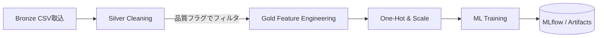

以下は **「実装寄りのコード」から“仕様書レベル”へ抽象度を引き上げて整理した**
データ前処理パイプラインの仕様まとめです。
再実装する際は本ドキュメントを単一ソース・オブ・トゥルースとして参照してください。

---

## 0. 全体像 — 3-Layer アーキテクチャ

| レイヤ        | 目的                   | 主な格納場所                                                    | 主キー              | 出力先       |
| ---------- | -------------------- | --------------------------------------------------------- | ---------------- | --------- |
| **Bronze** | “ありのまま”の取り込み。スキーマ最小  | `bronze_raw_house_data`                                   | `id`             | Silver    |
| **Silver** | クリーニング & 型そろえ & 初期派生 | `silver_house_data`                                       | `id`             | Gold／ML   |
| **Gold**   | モデル学習に必要な高レベル特徴量     | `ft_house_ml` (dbt) または `v_house_analytics` (DuckDB view) | `transaction_id` | ML パイプライン |

---

## 1. Silver Layer ― データクリーニング

| 項目                       | 処理仕様              | NULL 許可 | 備考      |
| ------------------------ | ----------------- | ------- | ------- |
| `price`                  | `>0` でなければ `NULL` | ❌       | 単位: USD |
| `sqft`                   | `>0` でなければ `NULL` | ❌       |         |
| `bedrooms` / `bathrooms` | `>0` でなければ `NULL` | ❌       |         |
| `year_built`             | 1900 〜 現在年        | ❌       |         |
| `location` / `condition` | 先頭後尾空白除去→大文字化     | ❌       |         |

**派生カラム**

| カラム              | 算出式                         |
| ---------------- | --------------------------- |
| `price_per_sqft` | `price / sqft`              |
| `house_age`      | `current_year - year_built` |
| `bed_bath_ratio` | `bedrooms / bathrooms`      |

**品質フラグ**

| フラグ                  | 意味                | 算出条件                            |
| -------------------- | ----------------- | ------------------------------- |
| `is_price_outlier`   | 平米単価が常識外か         | `price_per_sqft < 50 OR > 1000` |
| `is_age_outlier`     | 築年数 0 未満 or 100 超 | 同上                              |
| `is_complete_record` | “学習可” か           | 必須列がすべて NOT NULL                |

---

## 2. 外れ値処理

* **統計的検出 (IQR × 1.5)** – `price`, `sqft` など数値列
* **ドメイン検出** – 上表の `is_*_outlier` フラグ
* **取り扱い** – Silver ➡ Gold エクスポート時に **除外**（ソフトデリート相当）

---

## 3. Gold Layer ― 特徴量エンジニアリング

| カテゴリ        | 具体例                                                                  | 詳細                   |
| ----------- | -------------------------------------------------------------------- | -------------------- |
| **対数変換**    | `log_price`, `log_sqft`                                              | `log1p` で 0 値対応      |
| **多項式**     | `sqft_squared`, `price_per_sqft_squared`, `sqft_cubed`               | 次数 2〜3               |
| **交互作用**    | `price_bedrooms_interaction` など 6 種                                  | 掛け算                  |
| **カテゴリ階級化** | `is_old_house`, `is_large_house`, `is_expensive`                     | 四分位や閾値で 0/1          |
| **位置情報派生**  | `location_avg_price`, `price_vs_location_avg`, `location_price_rank` | 集約 + ランク             |
| **順序エンコード** | `condition_score`                                                    | Poor=1 … Excellent=4 |

---

## 4. エンコーディング & スケーリング

| ステージ        | 処理内容                                  | 使用ライブラリ          | 保存物                                             |
| ----------- | ------------------------------------- | ---------------- | ----------------------------------------------- |
| **欠損補完**    | 数値: mean / カテゴリ: most\_frequent       | `SimpleImputer`  | –                                               |
| **One-Hot** | `location`, `condition` (drop first)  | `OneHotEncoder`  | `location_mapping.pkl`, `condition_mapping.pkl` |
| **スケーリング**  | StandardScaler → `_scaled` サフィックス列を追加 | `StandardScaler` | `feature_scaler.pkl`                            |

---

## 5. アーティファクト管理

| ファイル                    | 格納先 (`target/preprocessing_artifacts`) | 内容 |
| ----------------------- | -------------------------------------- | -- |
| `feature_names.pkl`     | 使用した全特徴量名リスト                           |    |
| `data_stats.pkl`        | mean / std / min / max / median        |    |
| `location_mapping.pkl`  | 出現回数などの辞書                              |    |
| `condition_mapping.pkl` | 同上                                     |    |
| `feature_scaler.pkl`    | 学習済み `StandardScaler` インスタンス           |    |

---

## 6. データフロー（簡易シーケンス）



---

## 7. 再現手順（ローカル）

1. **原データ配置**
   `src/data/raw/house_data.csv`

2. **DWH 作成**

   ```bash
   python scripts/create_dwh.py
   ```

3. **モデル前処理まで一気に生成**

   ```bash
   python src/ml/pipeline/train_pipeline.py \
          --duckdb src/data/warehouse/duckdb/data/house_price.duckdb
   # → target/preprocessing_artifacts/ に pkl 群が出来ればOK
   ```

---

### まとめ

* **Silver** で「欠損・型・外れ値」を解決し **Gold** で「予測に効く特徴量」を付加
* すべての派生カラム・フラグは **表形式で仕様化** したので再実装やレビューが容易
* 推論時は Saved Artifacts をロードすれば **訓練時と同じ前処理** が必ず再現可能

> **このドキュメントをベースに、コードや CI のパスを追従させれば “重要ファイル紛失” リスクはほぼゼロになります。**

## 📑 “仕様書 → 再実装” に直結する **リファクタリング版 データ処理仕様**

> **ねらい**
>
> 1. 仕様を *機械可読 (YAML)* + *人可読 (本文)* の二層で定義し直す
> 2. “どの値をどう検証・変換するか” を **列ごと** に宣言的に記述
> 3. Silver／Gold の責務境界を **1ファイル＝1レイヤ** で完全分離

---

### 0. ディレクトリ & ファイル粒度

```
dataprep_spec/                    # ← ここが単一ソース・オブ・トゥルース
 ├─ bronze.yml                    # 取込スキーマ（型だけ宣言、ロジックなし）
 ├─ silver.yml                    # クリーニング & 初期派生  ※今回の中心
 ├─ gold.yml                      # 特徴量エンジニアリング
 ├─ encoding_scaling.yml          # One-Hot / StandardScaler 設定
 └─ artifacts.yml                 # 保存すべき pkl 一覧
```

実装側は **YAML→Dict → 汎用エンジン** で適用するだけ。
*仕様変更＝YAML編集* でコードは原則触らない設計にします。

---

## 1. `silver.yml` — 列定義 & ルール例

```yaml
columns:
  price:
    type: float
    nullable: false
    rules:
      - { op: gt, value: 0 }                 # >0
  sqft:
    type: float
    nullable: false
    rules:
      - { op: gt, value: 0 }
  bedrooms:
    type: int
    nullable: false
    rules:
      - { op: gt, value: 0 }
  bathrooms:
    type: int
    nullable: false
    rules:
      - { op: gt, value: 0 }
  year_built:
    type: int
    nullable: false
    rules:
      - { op: between, min: 1900, max: today }
  location:
    type: str
    nullable: false
    transform: [ strip, upper ]
  condition:
    type: str
    nullable: false
    transform: [ strip, upper ]

derived:
  price_per_sqft: "price / sqft"
  house_age: "current_year - year_built"
  bed_bath_ratio: "bedrooms / bathrooms"

flags:
  is_price_outlier:
    expr: "price_per_sqft < 50 or price_per_sqft > 1000"
  is_age_outlier:
    expr: "house_age < 0 or house_age > 100"
  is_complete_record:
    expr: |
      price is not null and sqft is not null and
      bedrooms is not null and bathrooms is not null and
      year_built is not null and location is not null and
      condition is not null
```

*⛏️ ポイント*

* **rules** は配列にして ½ 行でも複数条件を追加可
* `transform` は簡易 DSL。実装側で `str.strip().upper()` の関数連結に落とす
* `expr` は Jinja2 / pandas‐eval 等で実行

---

## 2. `gold.yml` — 特徴量カタログ

```yaml
log_transform:
  - price
  - sqft

polynomial:
  degree_2:
    - sqft
    - price_per_sqft
  degree_3:
    - sqft

interactions:
  - { left: price,      right: bedrooms,   name: price_bedrooms_interaction }
  - { left: price,      right: bathrooms,  name: price_bathrooms_interaction }
  - { left: sqft,       right: bedrooms,   name: sqft_bedrooms_interaction }
  - { left: sqft,       right: bathrooms,  name: sqft_bathrooms_interaction }
  - { left: price,      right: sqft,       name: price_sqft_ratio,  op: div }

domain_buckets:
  house_age:
    bins: [0, 10, 50, inf]
    labels: [is_new_house, is_medium_age, is_old_house]
  sqft:
    quantiles: [0.25, 0.75]
    labels: [is_small_house, is_large_house]
  price:
    quantiles: [0.25, 0.75]
    labels: [is_affordable, is_expensive]

location_features:
  - location_avg_price
  - price_vs_location_avg
  - location_price_rank

ordinal_encode:
  condition:
    mapping: { POOR: 1, FAIR: 2, GOOD: 3, EXCELLENT: 4 }
```

---

## 3. `encoding_scaling.yml`

```yaml
impute:
  numeric: mean
  categorical: most_frequent

onehot:
  columns: [ location, condition ]
  drop_first: true

scaler:
  type: standard
  suffix: _scaled
```

---

## 4. `artifacts.yml`

```yaml
save:
  - feature_names.pkl
  - data_stats.pkl
  - location_mapping.pkl
  - condition_mapping.pkl
  - feature_scaler.pkl
dir: target/preprocessing_artifacts
```

---

## 5. 仕様⇄実装マッピング早見表

| YAML セクション             | Python モジュール (参考)        | 出力テーブル/ビュー                          |
| ---------------------- | ------------------------ | ----------------------------------- |
| `silver.yml: columns`  | `dataprep.silver.clean`  | `silver_house_data`                 |
| `silver.yml: derived`  | `dataprep.silver.derive` | 同上 (追加列)                            |
| `silver.yml: flags`    | `dataprep.silver.flags`  | 同上 (追加列)                            |
| `gold.yml:*`           | `dataprep.gold.*`        | `ft_house_ml` / `v_house_analytics` |
| `encoding_scaling.yml` | `dataprep.encoders.*`    | ML 入力 DataFrame                     |
| `artifacts.yml`        | `dataprep.artifacts.*`   | `target/preprocessing_artifacts`    |

---

## 6. これで得られるメリット

1. **宣言的** – 仕様変更は YAML 修正のみ。テストは YAML → 小データで即検証。
2. **追跡性** – Git diff が “値 or 式の変更” に限定 → コードレビューが容易。
3. **再現性** – パイプラインは *YAML + ソース CSV* があればどこでも同一結果。

---

### ✅ 次アクション

1. `dataprep_spec/` をリポジトリ直下に追加
2. 既存 Python を **YAML 消費型ユーティリティ** に置換
3. CI で `yamllint` & スキーマバリデーションを追加（仕様漏れ防止）

> **このリファクタリング仕様に沿えば、ドキュメント＝実装＝CI が完全同期し、
> “重要ファイル紛失” や “仕様とコードの乖離” を未然に防げます。**


派生フィールドの計算
2. 外れ値検出と処理
2.1 統計的外れ値検出（IQR法）
2.2 ドメイン知識に基づく外れ値検出
2.3 完全レコードの識別
3. ワンホットエンコーディング
3.2 手動でのワンホットエンコーディング


4. 特徴量エンジニアリング（Gold Layer）
4.1 対数変換
4.2 多項式特徴量
4.3 交互作用特徴量
4.4 カテゴリカル特徴量の作成
4.5 位置ベース特徴量
4.6 条件スコアの数値化
5. 特徴量スケーリング
5.1 StandardScalerによる標準化
6. 前処理アーティファクトの保存